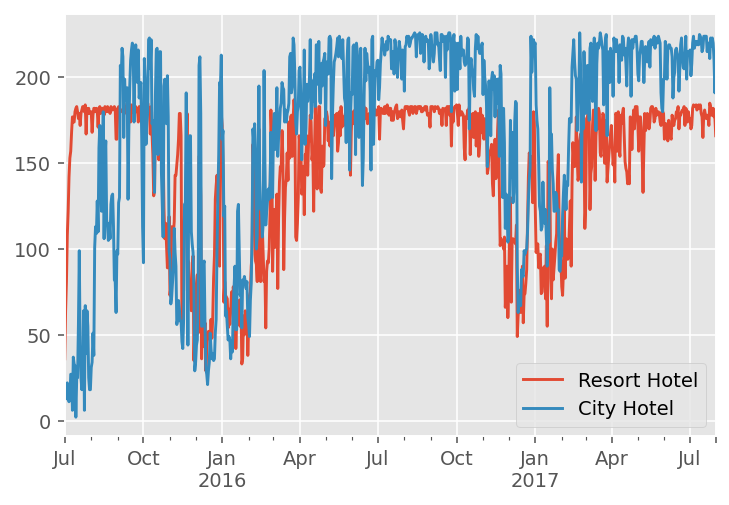
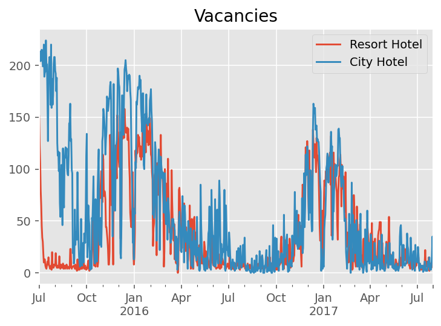
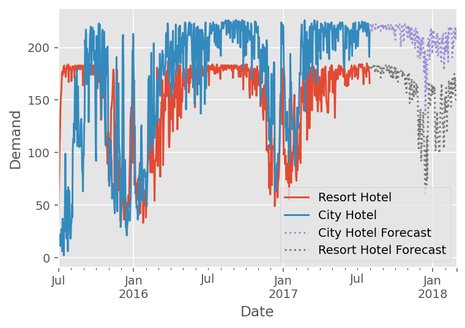
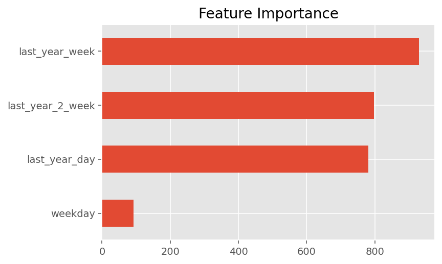

# hotel-booking-demand

Forecasting hotel demand was a small datathon within the commercial team at my company (<elderresearch.com>). It was a challenging problem with a fun solution worth sharing. All the work was done within a 3-hour timeframe.

- [hotel-booking-demand](#hotel-booking-demand)
  - [Background](#background)
  - [Solution](#solution)
    - [Modeling Vacancies](#modeling-vacancies)
    - [Feature Engineering](#feature-engineering)
  - [Conclusion](#conclusion)

## Background

Forecasting with "small data" is a common and surprisingly difficult task. It is easy to overfit and difficult to distinguish the signal from the noise with so few datapoints. While there are many standard methods out there such as ARIMA and Prophet, these will often be outperformed by the mean in performance evaluation.

The dataset contains booking information for a city hotel and a resort hotel, including information on when the booking was made, length of stay, number of adults, and more. There is one row per booking in the data.

In order to forecast demand, the data has to be transformed to be one row per date per hotel type. This was completed in the `notebooks/hotel_cleaning.ipynb` notebook. After that was finished, the demand over time looked like this:

August 2017 was removed to be used as an evaluation dataset.

## Solution

### Modeling Vacancies

The two primary challenges in modeling this dataset were:

1. Small size, having less than two full periods
2. Having a hard upper bound that is different for each hotel and that the data often runs up against.

Some observations that were relevant to the model type:

1. There is a strong yearly seasonality that the solution should take into account, despite not having two full periods.
2. There is little autocorrelation
3. Both hotels have similar patterns, making a global model preferrable.
4. The test period (August) will likely be near the capacity, so it will important to take that into account
5. There appears to be a small weekday effect.

Based on this, I chose to model the vacancies instead of the demand, since this makes the dataset a much more common structure--right-skewed, zero-inflated. This also makes the data structure similar between the two datasets.

The LightGBM modeling framework is a flexible one allowing different loss functions that typically does well on forecasting competitions. It can't just be plugged in--features have to be hand-crafted to extract the signal from the dataset.

### Feature Engineering

Autocorrelation is low on this dataset, while correlation to the previous year is high, and there is weekly seasonality. Therefore, I chose to encode the following four features:

1. Vacancies last year, same day
2. Vacancies last year, week centered on same day
3. Vacancies last year, 2-week period centered on same day
4. Day of week

LightGBM was used with the default settings except the `tweedie` objective function was used, which is good for right-skewed zero-inflated data. This setup ensures that it's impossible to predict above the capacity of the hotel, since `tweedie` will not let a prediction go below zero. The features used are able to capture that yearly seasonality well by balancing between what was seen on the exact day last year vs what happened around that day last year. The resulting predictions are shown below:

The feature importances for the model:

## Conclusion

Small data forecasting challenges require careful handling. Plugging the data directly into a forecasting algorithm will often end up overfitting. In this case, by using the `tweedie` loss function on hotel vacancies instead of demand, and encoding the clearly strong yearly seasonality into features, LightGBM was able to produce sensible predictions that ended up winning the datathon.
